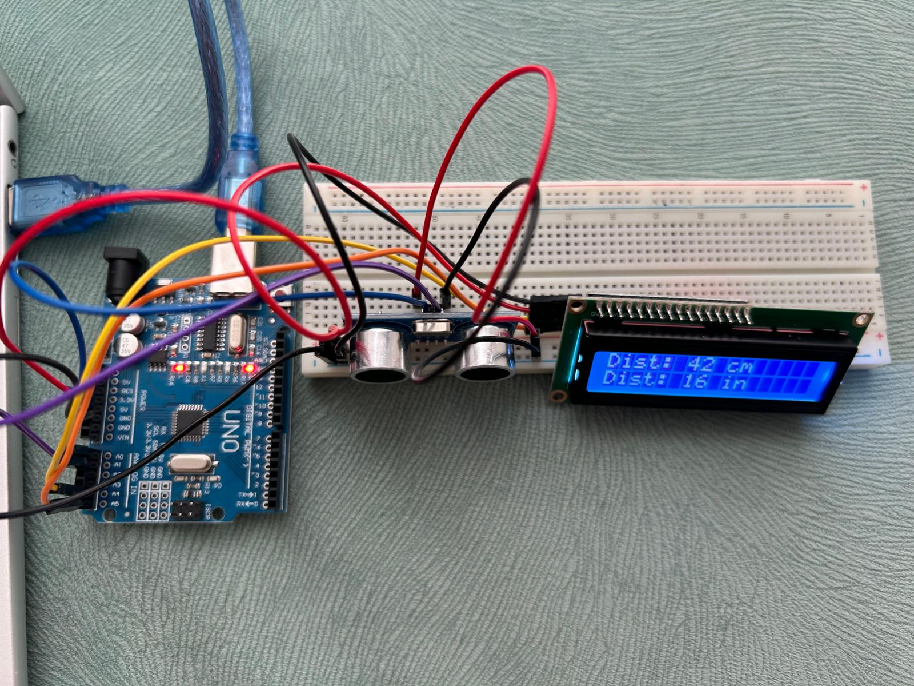

# 📏 Embedded Distance Measurement System with I2C LCD

This project demonstrates a real-time distance measurement system built using an **Arduino Uno**, an **HC-SR04 Ultrasonic Sensor**, and a **16x2 Character LCD Display with I2C Module**.

## 📌 Features
* **Real-time Measurement:** Calculates object distance using ultrasonic wave propagation times.
* **Dual Unit Support:** Displays values simultaneously in both centimeters ($cm$) and inches ($inch$).
* **I2C Communication:** Simplified 4-wire interface for data transmission to the LCD.

## 🛠️ Hardware Components
* Arduino Uno Rev3
* HC-SR04 Ultrasonic Sensor Module
* 16x2 Character LCD Display with PCF8574 I2C Adapter
* Breadboard & Jumper Wires

## ⚙️ How It Works
1. The **HC-SR04** sends a high-frequency sound pulse via the `Trigger` pin (`A0`).
2. The pulse reflects back from the target object and is received by the `Echo` pin (`A1`).
3. The duration of the echo signal is measured using microsecond-level timing functions.
4. Distance is calculated using the speed of sound formula: 
   $$\text{Distance} = \frac{\text{Duration} \times \text{Speed of Sound}}{2}$$
5. The processed measurements ($cm$ and $inch$) are transmitted over the **I2C bus** (`A4/SDA`, `A5/SCL`) and rendered on the 16x2 LCD.

## 📸 Hardware Setup & Result

